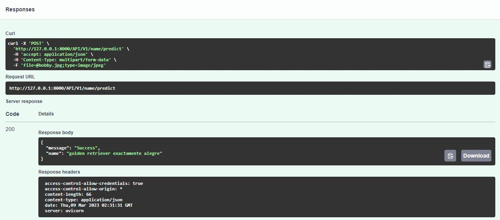

# NAME IT! - Backend
Author: Diego Steven Vera Vilca

_Api services used for the project Name it, contains the model to predict the name of the pet._

## Requirements
All the libraries used in the project are in requirements.txt.

```bash
pip install -r requirements.txt
```

## Run the project
* Run the command:
```bash
uvicorn main:app --reload
```
* Will be launch on http://127.0.0.1:8000/
* You can try the API model on http://127.0.0.1:8000/docs#/Name_pet/name_it_API_V1_name_predict_post
* Upload an animal image in the previous service. The response could be like the next image:

